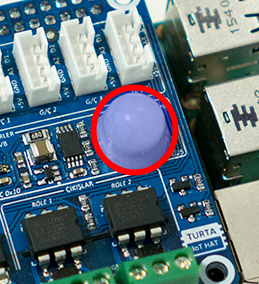
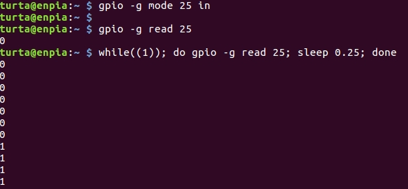
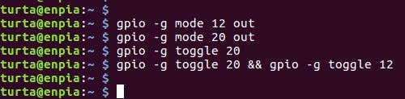
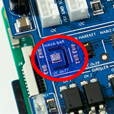
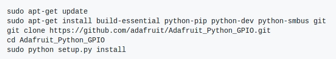
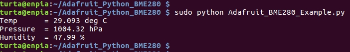
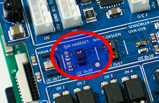
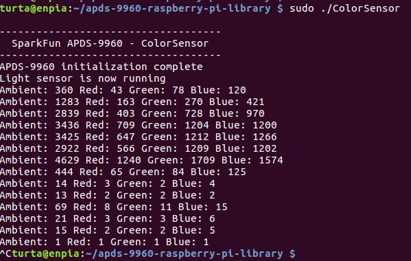
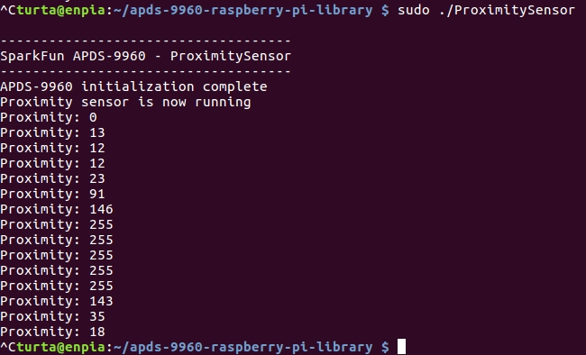
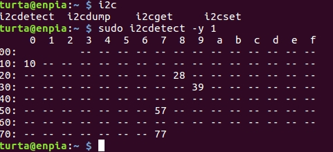

# Raspberry Pi ve IoT Başlangıç Eğitim Notları
##### *Murat Boyar, [about.me/muratboyar](https://about.me/muratboyar), 07/2017, v2.0*

---
### Linux dd komutu ile Raspi imajı yakmak
* Birinci terminalde:
	* `$> sudo dd if=~/prj-ev/kapiulu/img/rpi_35v3_jessie8_kernel_4_1_12.img of=/dev/sdX bs=4M`
* İkinci terminalde
	* `$> while((1)); do sudo kill -USR1 $(pidof dd); sleep 2; done`

**UYARI:** Burada dd komutu argumani "of=/dev/sdX" ifadesindeki X degeri, disks GUI uygulaması veya "df -H" ile bulunabilir. Yanlis X degeri geri donusu olmayan sonuclar doguracaktir. Dikkatli olun yada ***noobs*** kullanmaya devam edin.

---
### Simple HTTP Server
`$> cd <Paylasmak istdiginiz klasor>` e.g. cd $HOME/Music
`$> python -m SimpleHTTPServer 7777`
`$> ifconfig` ile IP adresinizi ogrenin, genelde `eth0` ve `wlan0` bloklarının altnda "inet addr:" yaninda yazar.
Browserdan `http://<IP>:<Port>` yazin, e.g. `http://192.168.1.100:7777`

---
### Raspinize pi kullanicisi olarak SSH ile uzaktan baglanmak
* Windows ve Linux masaüsütünde Putty kullanarak.. http://www.putty.org
* Linux komut satırında ise;
	* `$> ssh pi@192.168.1.66` ardindan raspi kullanici sifreniz.

---
### GPIO Komut satırı
```sh
$> gpio
$> gpio readall
$> while((1)); do gpio readall; sleep 0.25; clear; done
$> gpio mode 0 out
$> gpio write 0 1
$> gpio write 0 0
$> while((1)); do gpio write 0 1; sleep 0.5; gpio write 0 0; sleep 0.5; done
```

---
### Python GPIO Modülleri

* Bu bölüme aşağıdaki kurulumlar ile başlayalım
```sh
$> sudo apt install ipython
$> sudo pip install wiringpi2
```
* Bu kurulumda karşımıza çıkan Python.h header dosyasının bulunamaması
sorunu için örnek bir araştırma/çözüm yolu
	* Yol 1
		* `$> sudo apt-get install python-dev`
	* Yol 2
		* `$> python --version` komutu ile gelen versiyon bilgisi dikkate alınır
		* `$> sudo apt install apt-file`
		* `$> apt-file -l search Python.h` komutu ile dosyayı içeren paket listesini alırız
		* `$> sudo apt install libpython2.7-dev` yukarıdaki listeden bu paketi seçme sebebi: kutuphane paketlerinin “lib” ile başlaması, python versiyonumuzun “2.7” olması ve header dosyalarının “-dev” ile biten paketlerde bulunması.

#### 1) gpiozero ornegi icin ipython promptuna satir satir yazilacaklar
```python
from gpiozero import LED
from time import sleep
led = LED(17)
while True:
	led.on()
	sleep(1)
	led.off()
	sleep(1)
```
#### 2) RPi.GPIO ornegi icin ipython promptuna satir satir yazilacaklar
```python
import RPi.GPIO as m_out
m_out.setmode(m_out.BCM)
m_out.setwarnings(False)
m_out.setup(17, m_out.OUT)
m_out.output(17, m_out.HIGH)
m_out.output(17, m_out.LOW)
```
#### 3) wiringpi ornegi icin ipython promptuna satir satir yazilacaklar
```python
import wiringpi as wpi
wpi.wiringPiSetup();
wpi.pinMode(0, wpi.OUTPUT)
wpi.digitalWrite(0, wpi.HIGH)
while True:
	wpi.digitalWrite(0, wpi.HIGH)
	wpi.delay(1000)
	wpi.digitalWrite(0, wpi.LOW)
	wpi.delay(1000)
```
---
### WiringPi Raspi-Arduino uyumu

`$> nano blink_rpi_makerhane.c`

nano editoru icine yazilacak satirlar:

```c
#include <wiringPi.h>

void setup(){
	wiringPiSetup () ;
	pinMode (0, OUTPUT) ;
}
void loop(){
	digitalWrite (0, HIGH);
	delay (500);
	digitalWrite (0, LOW);
	delay (500);
}
int main (void) {
	setup();
	while(1){
		loop();
	}
	return 0 ;
}
```

```sh
$> gcc -Wall -o blink_rpi blink_rpi_makerhane.c -lwiringpi
$> ./blink_rpi
```
---
### Raspiyi strese sokmak icin:
```sh
$> sudo apt install stress
$> stress --cpu 10 --io 20 --vm 6 --vm-bytes 25M --timeout 120s
```
**UYARI:** Islemci cok isinabilir.

---
### Turtalı İşler
Turta​ ® isimli Raspberry Pi için tasarlanmış I/O ve sensör genişletme kartını (HAT) duymuşsunuzdur. Turta® ​[github.com_Turta-io_IoTHAT](https://github.com/Turta-io/IoTHAT) sayfalarında da hayranlık uyandıran bir düzende ve detayda erişimlerini örneklerle bizlere açıyor ancak şuan için yalnızca Windows 10 odaklı dokümanlar ve kaynak kodlar mevcut. Biz ise şirin penguenleriz. Raspberry Pi üzerinde bir Debian türevi olan ve toplulukça resmi olarak desteklenen Raspbian kullanmak istiyoruz. O halde gelin bu yazıda Turta​ ® için Linux erişimleri konusuna bir giriş yapalım.

* **PIR Sensör**
I2C bus dışında Raspberry Pi GPIO’larına doğrudan erişim de mümkün. Örneğin; GPIO20 ve GPIO12 pinlerinde LCA717 solid state rölelere,  GPIO25 pini ile AM312 hareket sensörüne gpio komutu ile erişebiliriz. Röle çıkışlarına herhangi bir şey bağlamadan durumunu kart üzerindeki ledleri ile görebilirsiniz. Turta HAT dokümanında geçen tüm pin nolar BCM numaralandırmasına göredir.

Hareket sensörüne aşağıdaki gibi erişilebilir:

Röle ledleri aşağıda gibi toggle edilebilir:


* **Bosch Sensortec BME280 hava durumu sensörü**
Turta HAT üzerindeki Bosch Sensortec BME280 hava durumu sensörü ile sıcaklık, basınç, nem ve rakım ölçümleri yapmak mümkün.

Linux kullanıcısının erişimi için Adafruit’den faydalanacağız.
[github.com_Adafruit_Python_BME280](https://github.com/adafruit/Adafruit_Python_BME280)
Yukarıdaki linkte ve aşağıdaki resimdeki şekilde kurulumu gerçekleştirelim.

Ardından örneği aşağıdaki gibi çalıştırdığımızda değerler karşımızda olacak



* **APDS-9960 Işık, RGB, gesture ve mesafe sensörü**
Şimdi APDS-9960 Işık, RGB, gesture ve mesafe sensörüne erişelim.

[justinwoodman.wordpress.com__apds-9960](https://goo.gl/xKqUT6)
Linkte okuduğumuz gibi :
	* `$> git clone https://bitbucket.org/justin_woodman/apds-9960-raspberry-pi-library.git` komutu ile repoyu Raspberry Pi içine klonlayalım ve klasöre girelim ardından
	* `$> g++ -Wall -o  ColorSensor  ColorSensor.cpp APDS9960_RPi.cpp -lwiringPi` ve
	* `$> g++ -Wall -o  ProximitySensor  ProximitySensor.cpp APDS9960_RPi.cpp -lwiringPi` komutları ile örnek uygulamalarımızı derleyelim ve aşağıdaki resimlerdeki gibi çalıştıralım..



* **i2c-tools**
Turta HAT github sayfasında ve HAT kartın arka yüzeyinde gördüğümüz gibi BME280 I2C 0x77 adresi üzerinde ve APDS-9960 ise I2C 0x39 adresi üzerinden haberleşir. Cihazımıza bağlı tüm I2C aygıtları listelemenin bir yolu var şimdi buna değinelim: 
`$> sudo apt install i2c-tools` komutu ile yardımcı uygulama paketini kuralım. Ardından aşağıdaki resimdeki gibi uygulamayı çalıştıralım

Ayrıca 0x10 (VEML6075), 0x28 (TSOP38338 ve ADC) ve 0x57 (MAX30100)  sensörlerinin de bus’ta aktif olduğunu görüyoruz. ADC’ye i2c bus ile erişim için wiringPi kütüphanesi i2c fonksiyonlarını deneyebilirsiniz

---
### Linkler
* Giriş
	* raspberrypi.org/documentation
	* github.com/raspberrypi/documentation
	* raspberrypi.org/resources
	* github.com/raspberrypilearning
	* https://www.raspberrypi.org/help/faqs/#introWhatIs
	* https://www.raspberrypi.org/weekly/10millionpi/
	* https://www.element14.com/community/docs/DOC-68090/l/raspberry-pi-3-pi-2-b-a-compute-module-dev-kit-comparison-chart
	* http://hackerboards.com/misc/sbc-survey-june2016/hackerboards.com-june2016-sbc-survey-sp
ecs-table.pdf
	* https://en.wikipedia.org/wiki/ARM_architecture
	* http://www.arm.com/products/processors/cortex-a/cortex-a53-processor.php
* Raspbian
	* https://www.raspberrypi.org/downloads/noobs/
	* http://futurist.se/gldt/wp-content/uploads/12.10/gldt1210.svg
	* http://distrowatch.com/
	* https://www.raspberrypi.org/documentation/configuration/raspi-config.md
	* https://www.raspberrypi.org/documentation/configuration/config-txt.m
	* https://www.raspberrypi.org/documentation/linux/software/apt.md
* Çevre Birimleri
	* http://elinux.org/RPiconfig
	* https://www.raspberrypi.org/documentation/remote-access/vnc/
	* https://www.realvnc.com/download/viewer/
* GPIO
	* http://tr.pinout.xyz
	* http://wiringpi.com/examples/blink/
	* https://pypi.python.org/pypi/gpiozero/1.3.1
	* https://www.raspberrypi.org/learning/physical-computing-with-python/worksheet/
	* https://gpiozero.readthedocs.io/en/v1.3.1/
	* https://goo.gl/6h7hPd
	* https://goo.gl/iM4xXy
* IoT
	* http://www.cayenne-mydevices.com/docs/#introduction
	* https://developer.ibm.com/recipes/tutorials/raspberry-pi-4/
	* https://github.com/ibm-messaging/iot-raspberrypi/tree/master/samples/c#note-for-users-who-wa
nt-to-change-the-code-compile-and-build-the-deb-file
	* https://quickstart.internetofthings.ibmcloud.com/#/device/b827eb3370b8/sensor/
	* https://console.ng.bluemix.net/catalog/starters/internet-of-things-platform-starter
* Hackaday Pojeleri
	* https://hackaday.io/project/9314-babymon
	* https://hackaday.io/project/9315-kapikulu
* Kapanış
	* https://goo.gl/mHecjW
	* http://elinux.org/RPi_Hub
	* http://raspberrypi.stackexchange.com

##
